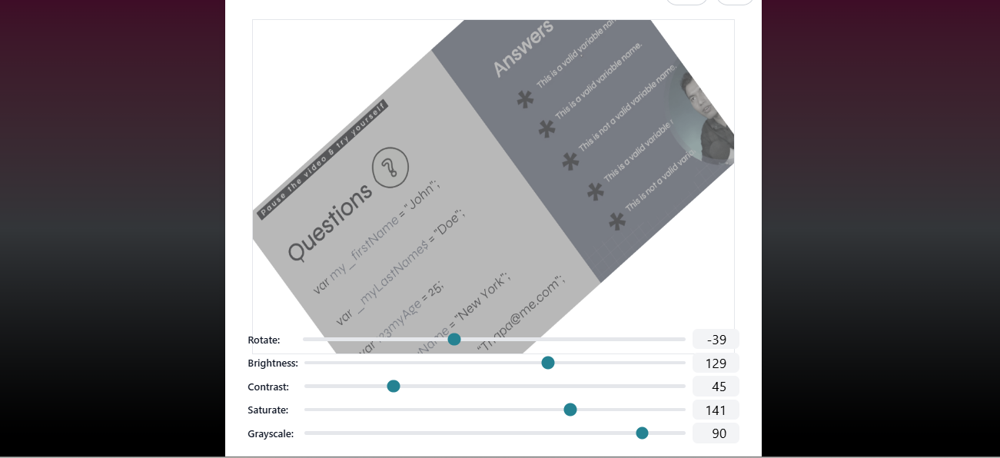

## Image Editor React App
# 📸 React Photo Editor App

A simple and modern image upload and editing application built with React. This app allows users to upload an image, preview it, open an editor, make adjustments, and download the edited image.

---

## 🚀 Features

* 📤 Upload images from your device
* 👀 Preview selected image before editing
* ✏️ Open a powerful photo editor
* 💾 Download edited image
* 🎨 Smooth animations using Animate.css
* 🖼️ Responsive and clean UI with Tailwind-style classes

---


## 🧠 How It Works

1. User clicks the upload box
2. File selector opens
3. Selected image is previewed
4. User clicks **"Open Editor"**
5. Image editor modal opens
6. After editing, image is saved and automatically downloaded

---

## 📸 Key Code Highlights

### File Selection

```javascript
const onFileChange = (e) => {
  const selectedFile = e.target.files?.[0];
  if (!selectedFile) return;
  setFile(selectedFile);
};
```

### Open Editor

```javascript
const openEditor = () => {
  if (file) {
    setOpen(true);
  }
};
```

### Save & Download Image

```javascript
const onSaved = (editedImage) => {
  const url = URL.createObjectURL(editedImage);
  const anchor = document.createElement('a');
  anchor.href = url;
  anchor.download = 'edited-image.png';
  anchor.click();
  URL.revokeObjectURL(url);
};
```

---

## ⚙️ Configuration

You can customize the editor behavior:

```jsx
<ReactPhotoEditor
  open={open}
  onClose={handleClose}
  file={file}
  onSaveImage={onSaved}
  downloadOnSave={false}
  closeOnClickOutside={false}
  maxCanvasHeight="30rem"
  canvasHeight="400px"
  maxCanvasWidth="36rem"
/>
```





