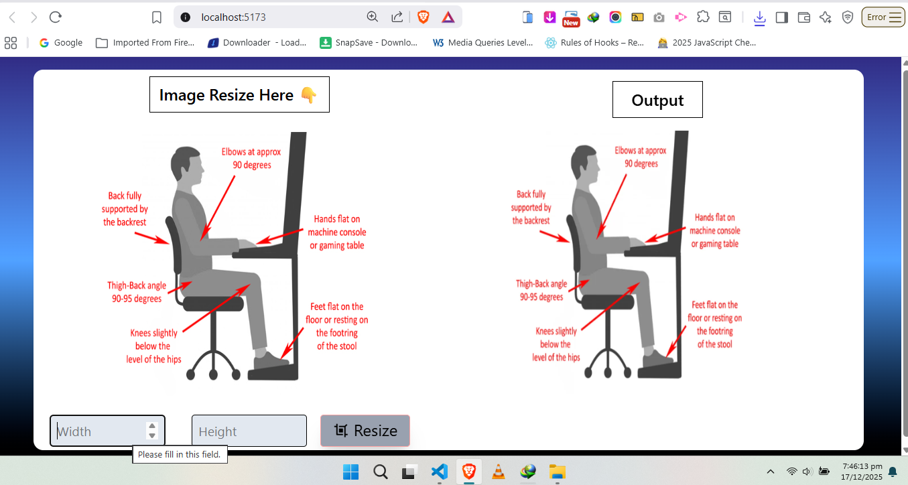

## Image Resize React App

- create logic approch with useState :
This React application demonstrates a practical image resizing solution using hooks.
It focuses on a clear and logical implementation built with useState.
Users can upload an image and view its original dimensions instantly.
Custom width and height inputs allow controlled resizing.
State management ensures real-time updates without page reloads.
The logic separates original and resized dimensions for accuracy.
Basic validation prevents invalid or empty inputs.
The UI is lightweight and responsive for better usability.
This project helps understand state-driven rendering in React.
Ideal for beginners learning React logic and hook-based workflows.

