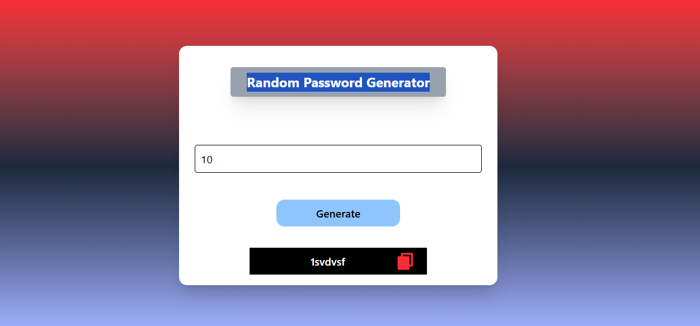

## Random Password Generator React App

 -  Random Password Generator Appliaction In React Js
 
Learned Random Password Generator using useState and TailwindCSS.Generates secure passwords with customizable length based on a predefined pattern.Users can input desired password length and generate a random password instantly.Displays the generated password in a read-only field with copy icon for convenience.Styled with responsive layout, gradients, shadows, and modern UI elements. Perfect for quickly creating strong passwords for online accounts and security needs.

- 

