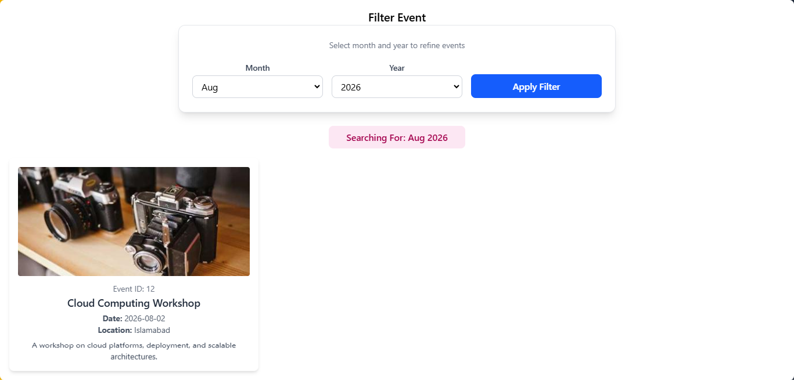

#   Event Manager React App

This is a React-based Event Manager application designed to display and filter events efficiently.
Users can browse a list of upcoming events with detailed information including date, location, and description.
The app provides month and year filtering to help users find relevant events quickly.
React Router is used for smooth navigation between pages.
Tailwind CSS is implemented for a modern, responsive, and clean user interface.
Reusable components improve code readability and maintainability.
Event data is dynamically rendered using JavaScript array methods.
The filtering logic is handled using controlled components and state management.
The application follows a mobile-first responsive design approach.
This project is ideal for practicing React fundamentals and UI structuring.

 
 