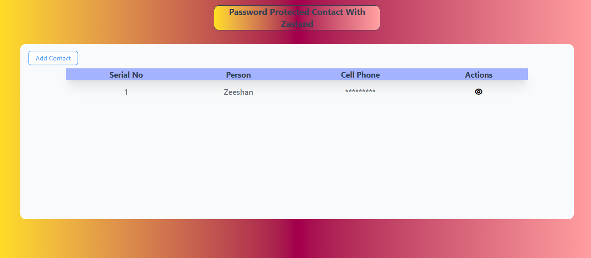

 ##  React Password Protected Contact With Zastand

  - Password Protected Contact With Zastand

  This React application demonstrates modal-based form handling using Ant Design components.
useState is used to control modal visibility for password unlocking and adding contacts.
The UI is styled with Tailwind CSS, Animate.css, and Remix Icons for a modern experience.
Contacts are displayed in a responsive table layout.
Sensitive contact information is protected via a password modal.
Ant Design Form validation ensures required inputs are provided.
The Add Contact modal allows users to dynamically submit new contact data.
This project is suitable for learning modal workflows and form state management in React.

 - 

