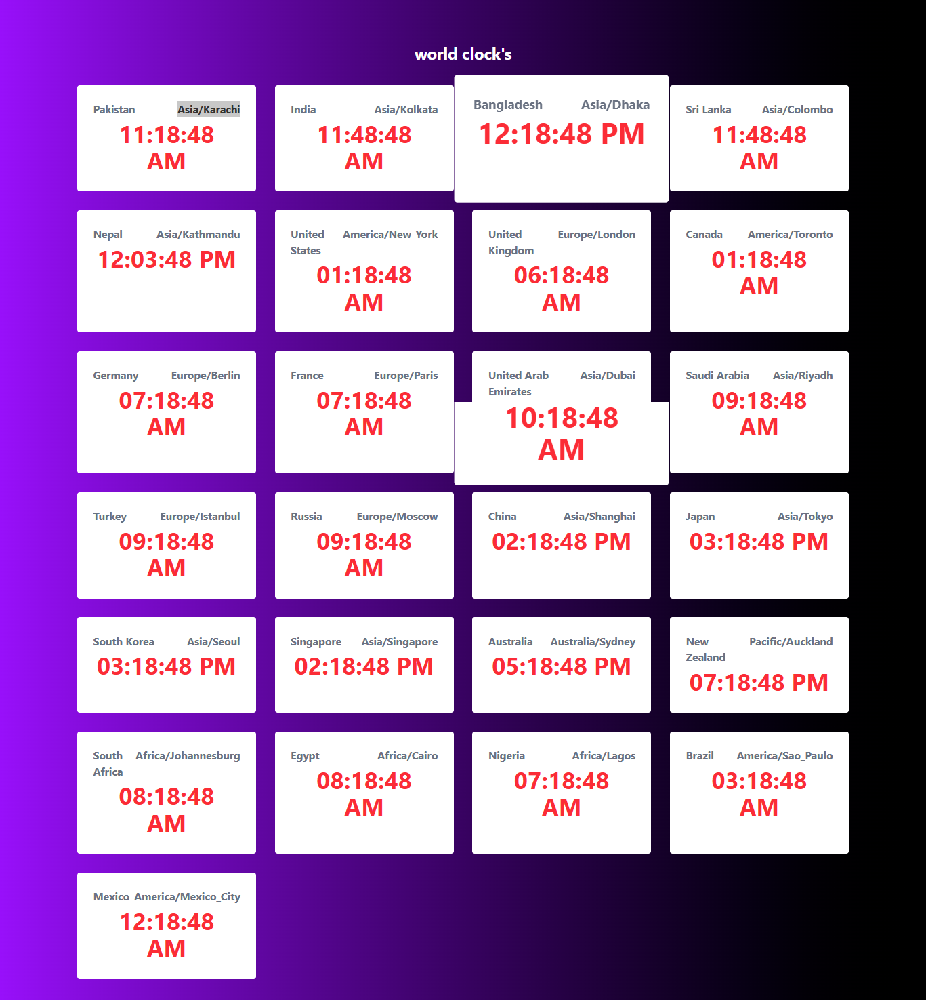

# World Timezone App

This project demonstrates time zone handling using Moment Timezone in a React application. Country and time zone data are stored as an array of objects for easy scalability.React useState is used to manage the selected country and its time zone dynamically.Moment Timezone converts and formats time based on the selected time zone.
The UI updates in real time when the user changes the country selection.
The implementation follows clean, reusable component structure.
This setup is ideal for time converters, schedulers, and global applications.
 