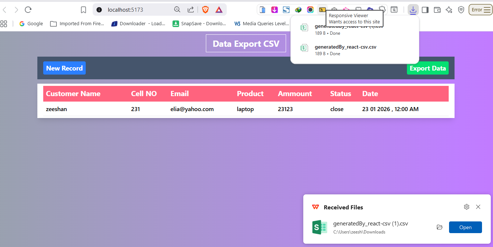

# Form Data Export CSV React App

## Features
Form Input Application built using React.js and Ant Design (AntD) components.
The project demonstrates controlled form handling with validation using AntD Form.
User input data is managed efficiently with React state and event handling.
Submitted form data is stored in a structured format within the application.
The application includes a CSV downloader to export user input data.
CSV files are generated dynamically based on submitted form values.
This project highlights clean UI design and practical data export functionality.

npm i prop-types
npm i react-csv-downloader

   