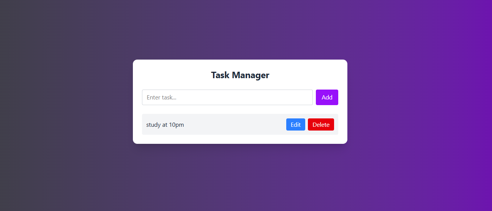

# Modren Task Manager React App

A modern task management application built with React and useReducer. Features full CRUD operations with a clean, responsive UI. The app demonstrates state management using React's useReducer hook, offering predictable state transitions through reducer patterns. Includes gradient backgrounds, smooth transitions, and intuitive task editing capabilities. Perfect for learning React state management concepts in a practical implementation.

 