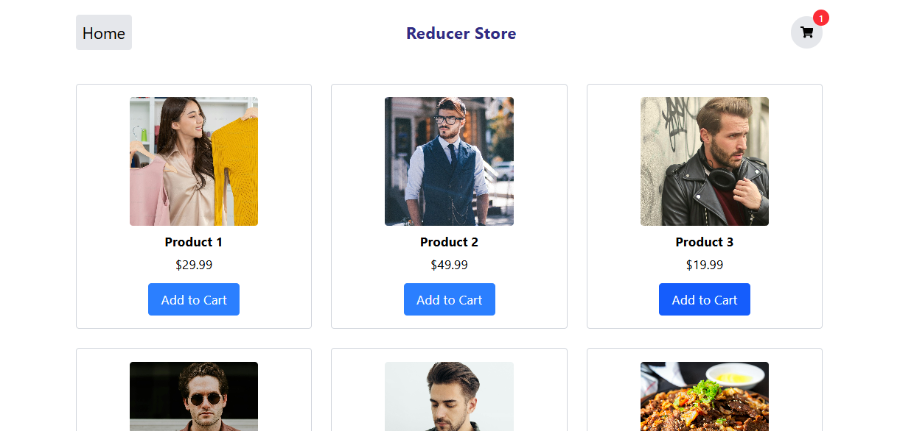

# Reducer Store App

A simple and scalable global state management setup for handling a shopping cart using React Context API and useReducer. This store allows you to add and remove products from a cart while automatically updating the total price.

 Practice use in Project :

1. `src/App.js` – Main app component where routes and providers are set up.
2. `context&reducer/StoreContext.js` – Creates React context and provides add/remove cart functions.
3. `context&reducer/StoreReducer.js` – Reducer logic and initial state for cart management.
4. `pages/Home.jsx` – Homepage showing product list.
5. `pages/Cart.jsx` – Shopping cart page displaying added products.
6. `pages/Product.jsx` – Optional product detail page.
7. `components/Nav.jsx` – Navigation bar with links and cart indicator.
8. `components/CartItem.jsx` – Component for displaying individual items in cart.
9. `components/addToCart.jsx` – Button/component handling product addition to cart.
10. All components use `StoreContext` to access and update cart state globally.

src/
├─ App.js
├─ context&reducer/
│  ├─ StoreContext.js
│  └─ StoreReducer.js
├─ pages/
│  ├─ Home.jsx
│  ├─ Cart.jsx
│  └─ Product.jsx (optional)
├─ components/
│  ├─ Nav.jsx
│  └─ CartItem.jsx
   └─ addToCart.jsx

