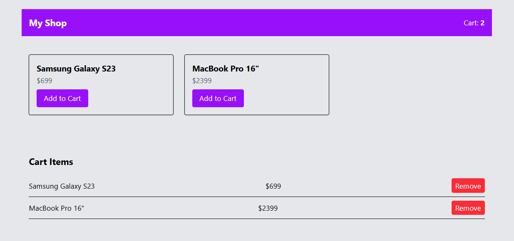

#  Zustand React E-Commerce Cart Logic

This is a beginner-friendly e-commerce project built with React, Tailwind CSS, and Zustand for state management.
Users can view products, add them to the cart, and remove items from the cart.
The cart count updates dynamically in the navigation bar.
Products are displayed in a responsive grid layout using Tailwind utilities.
State management is handled with Zustand for simplicity and scalability.
All components are created as functional components with React hooks.
Styling is fully done with Tailwind CSS for responsive design.
The project demonstrates basic React concepts like props, state, and event handling.
It’s perfect for beginners to practice component structure, hooks, and state management.
You can easily expand it with features like total price, quantities, and checkout functionality.

🧠 How It Works
📌 Zustand Store

The app uses a global store (useCartStore) to manage cart state:

cart → array of items
addItem(product) → adds item to cart
removeItem(id) → removes item from cart
🛒 Components Overview

🧾 Cart Component

Displays all cart items and allows removal.

const cart = useCartStore(state => state.cart);
const removeItem = useCartStore(state => state.removeItem);
Features:
Shows empty message when cart is empty
Lists all items with name & price
Remove button for each item

🧩 ProductCard Component

Displays a product and allows adding it to the cart.

const addItem = useCartStore(state => state.addItem);
Features:
Shows product name and price
"Add to Cart" button
Clean card UI with hover effects

📊 Example Product Object
{
  id: 1,
  name: "Product Name",
  price: 99
}

🔄 Data Flow
Product is displayed via ProductCard
User clicks Add to Cart
Item is stored in Zustand global state
Cart component updates automatically
User can remove items from cart

react-tailwind-ecommerce/
├─ public/
│  └─ index.html
├─ src/
│  ├─ components/
│  │  ├─ ProductCard.jsx
│  │  ├─ Cart.jsx
│  │  └─ Navbar.jsx
│  ├─ store/
│  │  └─ cartStore.js
│  ├─ App.jsx
│  ├─ index.js
│  └─ styles.css
├─ package.json
└─ tailwind.config.js
