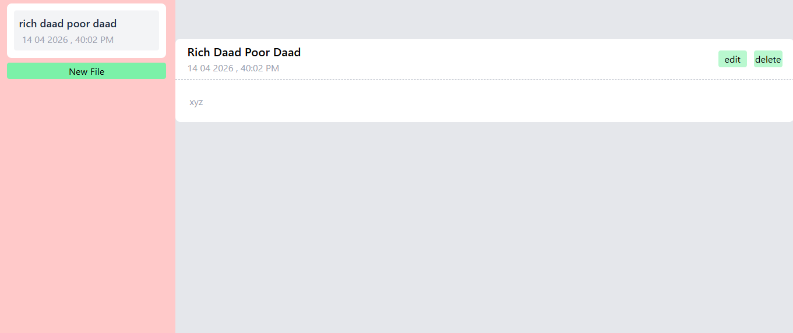

# 📝 Note Book App (React + Zustand + Ant Design)


This is a simple and efficient **Notes Management Application** built using **React**, **Zustand (state management)**, and **Ant Design (UI library)**.
It allows users to create, read, update, and delete notes in a clean and responsive interface.


##  Features

* 📄 Create new notes
* 📖 View note details
* ✏️ Edit existing notes
* 🗑️ Delete notes
* 🕒 Automatic date & time tracking
* ⚡ Fast state management using Zustand
* 🎨 Clean UI with Ant Design & Tailwind CSS


##  Tech Stack

* **Frontend:** React (Functional Components + Hooks)
* **State Management:** Zustand
* **UI Library:** Ant Design
* **Styling:** Tailwind CSS
* **Utilities:**

  * nanoid (unique IDs)
  * moment.js (date formatting)


## 📂 Folder Structure

```
src/
│
├── App.jsx
├── main.jsx
│
├── zustand/
│   └── useNote.js     # Zustand store for notes
│
├── components/        # (optional future use)
│
└── assets/
```


## 🧠 How It Works

### 🔹 State Management (Zustand)

All notes are stored in a global store:

* `notes` → list of notes
* `setNotes` → add note
* `deleteNote` → remove note
* `updateNote` → edit note


### 🔹 Note Structure

Each note contains:

```
{
  id: string,
  filename: string,
  content: string,
  date: Date
}
```

---

### 🔹 Core Functionalities

#### ➤ Create Note

* Opens modal form
* Generates unique ID using nanoid
* Saves current timestamp

#### ➤ Read Note

* Click note from sidebar
* Displays full content

#### ➤ Update Note

* Opens modal with pre-filled data
* Updates note using `updateNote`

#### ➤ Delete Note

* Removes note from store
* Clears selected note


## 🎯 Key Concepts Used

* React Hooks (`useState`)
* Controlled Forms (Ant Design Form)
* Global State with Zustand
* Conditional Rendering
* Component-based architecture


## ⚠️ Known Improvements (Future Enhancements)

* 🔍 Search functionality
* 💾 LocalStorage / Database persistence
* 🌙 Dark mode
* 📁 Folder/category system
* 🔔 Toast notifications
* 📱 Mobile responsiveness improvements


## 🧪 Example UI Flow

1. Click **"New File"**
2. Enter filename & content
3. Submit → Note appears in sidebar
4. Click note → View details
5. Edit/Delete as needed


## 📸 UI Highlights

* Sidebar for note navigation
* Detail panel for reading content
* Modal for create/edit actions


## 🤝 Contribution

Feel free to fork this project and improve it.
Pull requests are welcome.


## 📄 License

This project is open-source and available under the MIT License.


