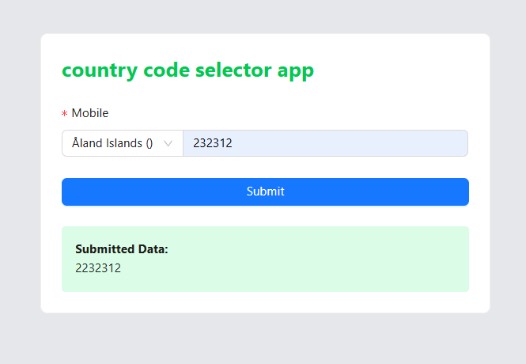

#  country code selector app

learned Uses country-codes-flags-phone-codes to populate dial codes dynamically.Combines selected country code with user-entered mobile number on submit.Formats the final payload before processing or sending to backend.

