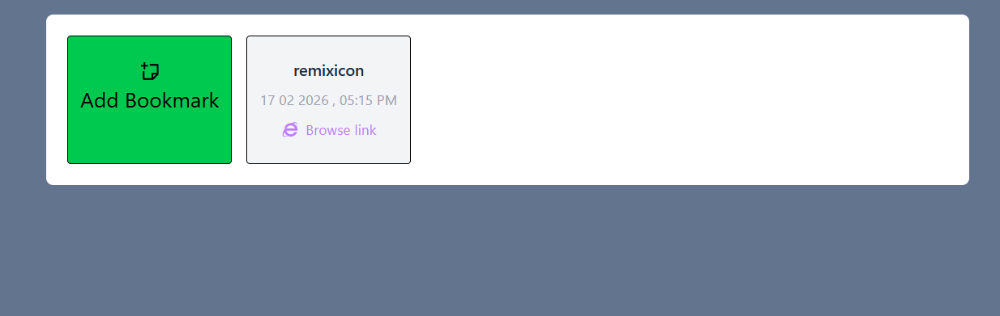

# Simple Bookmark Manager

This is a beginner-friendly simple Bookmark Manager built with React, Ant Design, and Zustand.Users can create and store bookmarks with a name and valid URL.
Each bookmark is assigned a unique ID and timestamp.
State management is handled using Zustand for lightweight global storage.
The UI is styled with Tailwind CSS and Remix Icons for a modern interface.

