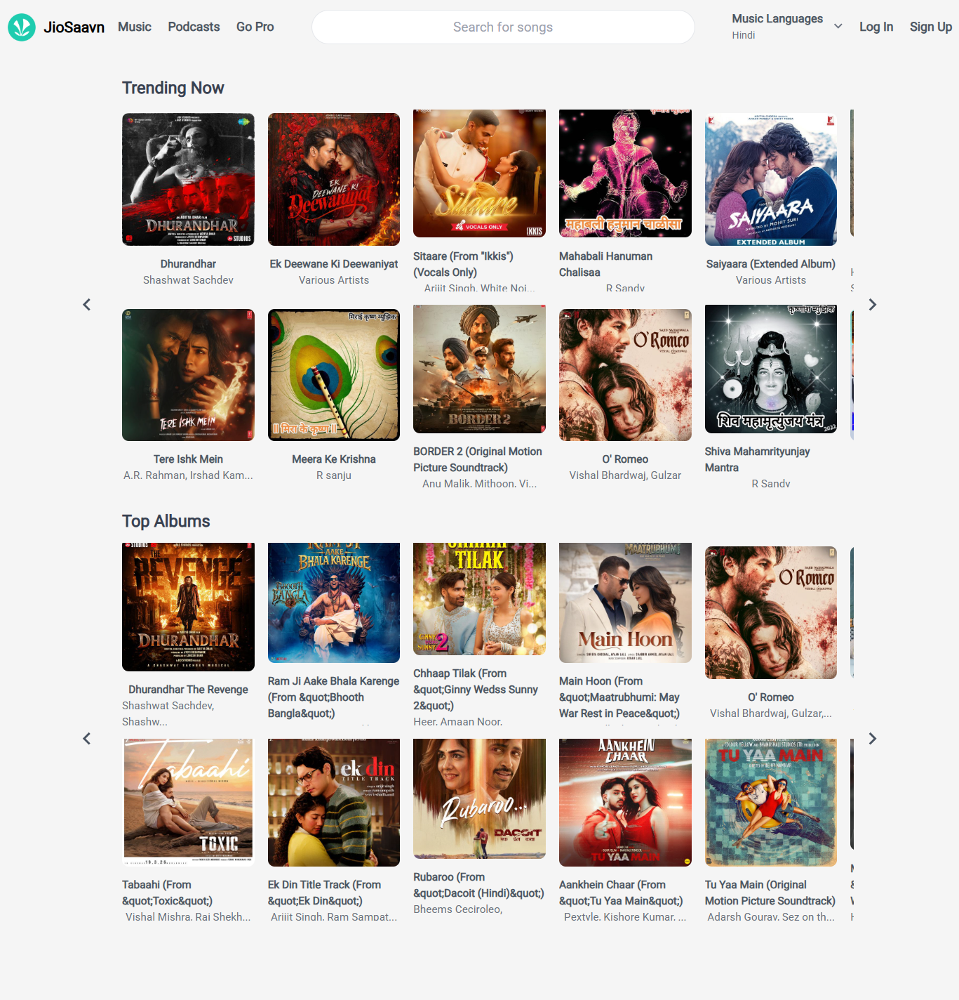
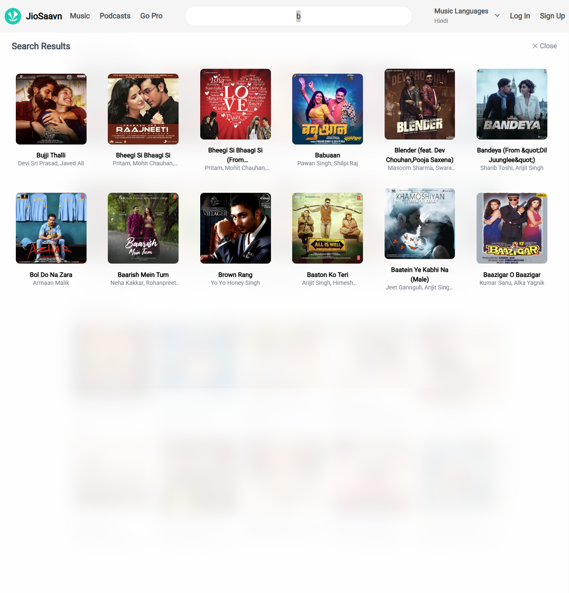

# 🎵 Jio Saavn Clone

A music streaming web app built with React and Vite, powered by the unofficial JioSaavn API.
Browse albums, search songs, and enjoy a fully functional music player — all in the browser.

---

##  Getting Started

git clone https://github.com/Zeeshanelia/100-Days-Of-React-Js-Coding-Repo/tree/main/75-%20Jio%20Saavn%20App%20with%20Context%20Api
cd 75- Jio Saavn App with Context Api-clone
npm install
npm run dev

## 📁 Project Structure

src/
├── components/        # Reusable UI components
│   ├── Navbar.jsx         # Top navigation bar with search
│   ├── Player.jsx         # Fixed bottom music player
│   ├── Slider.jsx         # Horizontal scrollable album slider
│   ├── AlbumItem.jsx      # Single album card
│   ├── SongsList.jsx      # Song row inside album detail page
│   ├── SongItem.jsx       # Song card inside search results
│   ├── SearchSection.jsx  # Full screen search results overlay
│   └── VolumeController.jsx # Hover volume slider
├── pages/
│   ├── Home.jsx           # Homepage with trending and top albums
│   └── AlbumDetails.jsx   # Album detail page with songs list
├── context/
│   └── MusicContext.js    # Global state context definition
└── App.jsx                # Root component with all global state and logic

## ⚙️ Functionality

### 🏠 Homepage — `Home.jsx`
- Renders the main landing page
- Displays two sections: Trending Now and Top Albums
- Both sections use the Slider component for horizontal scrolling

### 📡 Data Fetching — `MainSection.jsx`
- On mount, fetches homepage data from the JioSaavn API
- Endpoint: `/modules?language=hindi`
- Extracts `albums` and `trending.albums` from the response
- Passes data to the Slider component for rendering

### 🎠 Slider — `Slider.jsx`
- Renders a horizontally scrollable row of album cards
- Left and right arrow buttons scroll the list by 800px
- Hidden on mobile, visible on desktop (lg breakpoint)
- Uses a ref to directly control scroll position

### 🗂️ Album Card — `AlbumItem.jsx`
- Displays album cover image, name, and artists
- Clicking navigates to `/albums/:id` using React Router
- Safely falls back through image quality levels (high → low)
- Truncates artist names longer than 24 characters

### 📄 Album Details Page — `AlbumDetails.jsx`
- Fetches full album data by ID from the API on mount
- Endpoint: `/albums?id=:id`
- Displays album cover, name, artist, and song count
- Renders all songs using the SongsList component
- Saves the full songs array to global context for next/prev naviga

 
 