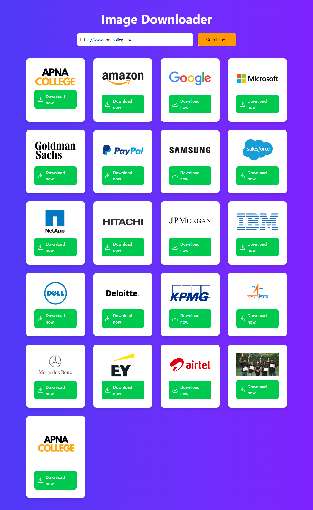

# 🖼️ Web Scarping Image Downloader (React)

A fast and user-friendly **Web Scarping Image Downloader (React)  App** that allows users to extract and download images from any website URL. Built with React and integrated with a backend API to fetch images dynamically.

---

## 🚀 Features

* 🌐 Enter any website URL to fetch images
* ⚡ Fast API-based image extraction
* 📥 One-click image download
* 🔄 Loading spinner for better UX
* 🔔 Error handling with toast notifications
* 🎨 Smooth animations with modern UI

---

## 🛠 Tech Stack

* **React 18** – Frontend UI
* **Axios** – API requests
* **React Toastify** – Notifications & error handling
* **Lucide React** – Icons
* **Animate.css** – Animations
* **Tailwind CSS** – Styling

---


This project depends on a backend API:

```bash id="6g4tpx"
POST http://localhost:8080/api/images
```

### Request Body:

```json id="flp9cs"
{
  "url": "https://example.com"
}
```

### Response:

```json id="0w4j1l"
[
  "https://image1.jpg",
  "https://image2.png"
]
```

> ⚠️ Make sure your backend is running before using the app.

---

## ⚡ How It Works

### 1. Input URL

* User enters a valid website URL

### 2. Fetch Images

* Axios sends a POST request to backend
* Backend scrapes/extracts image URLs

### 3. Display Images

* Images are rendered in a responsive grid

### 4. Download Images

* Each image has a **Download button**
* Uses native `<a download>` functionality

---

## 🧠 Core Concepts Used

* React Hooks (`useState`)
* API integration using Axios
* Conditional rendering (loading state)
* Error handling with toast notifications
* Dynamic list rendering
* UX improvements with animations

---


- Project image
 