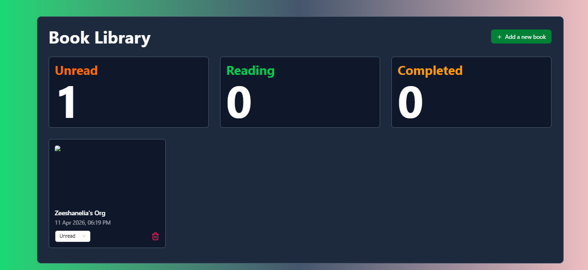

Book Library
A sleek React-based personal book tracking app to manage your reading list.
Features

Add books with a title and optional poster image URL
Track reading status: Unread, Reading, or Completed
Live count dashboard for each status category
Delete books from your library
Smooth animations powered by Animate.css

Tech Stack

- React — UI , Tailwind CSS — utility-first styling
- Ant Design — UI components (Modal, Form, Select, Button)
- Zustand — lightweight state management (useBook store)
- Moment.js — date formatting , Lucide React — icons
- Nanoid — unique ID generation

Usage of app
Click "Add a new book", enter the book name and an optional cover image URL, then hit Save. Use the dropdown on each card to update its reading status, or the trash icon to remove it.

