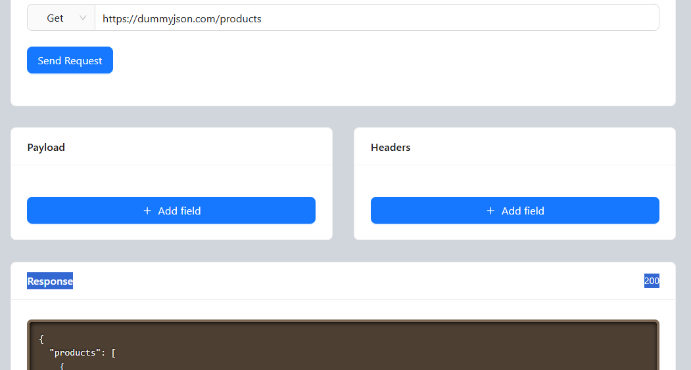

#  HTTP Client Test (React API Testing Tool)

A simple and powerful **API testing tool** built with **React**. This app allows developers to send HTTP requests, customize headers and payloads dynamically, and view formatted JSON responses — similar to a lightweight version of Postman.


##  Features

 -  Send HTTP requests (GET, POST, PUT, PATCH, DELETE)
 -  Dynamic **Payload (Body)** fields
 -  Dynamic **Headers** configuration
 -  Real-time API response viewer
 -  Syntax-highlighted JSON output
 -  Loading states and error handling
 -  Clean and modern UI using Ant Design
 -  Unique field handling with `nanoid`


## 🛠️ Tech Stack

* **React** (Functional Components + Hooks)
* **Ant Design (antd)** – UI Components
* **Axios** – HTTP Requests
* **React Syntax Highlighter** – JSON formatting
* **Lucide React** – Icons
* **NanoID** – Unique IDs
* **Animate.css** – Animations


## 🧠 How It Works

### 1. Request Configuration

* User selects HTTP method (GET, POST, etc.)
* Inputs API URL
* Adds optional **headers** and **payload**

### 2. Dynamic Fields

* Payload and headers are managed via `useState`
* Fields can be:

  * ➕ Added dynamically
  * ❌ Removed dynamically
* Each field uses a unique `id` from `nanoid`

### 3. Sending Request

* Axios is used to send requests:

```js
axios({
  method: values.method,
  url: values.url,
  data: payload,
  headers: headers
})
```

### 4. Response Handling

* Response status is stored
* Response data is formatted using:

```js
JSON.stringify(response.data, null, 2)
```

* Displayed with syntax highlighting

### 5. Error Handling

* Displays error message using Ant Design `message.error`
* Fallback status code: `500`

---

## 📊 State Management

| State Variable  | Purpose                             |
| --------------- | ----------------------------------- |
| `payloadFields` | Stores request body key-value pairs |
| `headerFields`  | Stores request headers              |
| `loading`       | Controls loading state              |
| `result`        | Stores API response                 |
| `status`        | Stores HTTP status code             |

---

## 🎯 Key Functions

### `sendRequest(values)`

* Builds payload & headers
* Sends HTTP request via Axios
* Updates response and status

### `addField(fieldName)`

* Adds new payload or header field dynamically

### `removeField(fieldName, id)`

* Removes field based on ID

### `handleKeyValue(fieldName, type, value, id)`

* Updates key/value of specific field

---

## 🎨 UI Overview

* 📦 **Card 1**: Request input (method + URL)
* 📦 **Card 2**: Payload editor
* 📦 **Card 3**: Headers editor
* 📦 **Card 4**: Response viewer (JSON)

---

## 🚧 Limitations (Can Be Improved)

* No request history
* No environment variables support
* No authentication helpers (Bearer token UI)
* No file upload support
* No query params builder

---

## 🔥 Future Enhancements

* Save & load API collections
* Add authentication (JWT, OAuth)
* Dark/light mode toggle
* Export responses
* Add query parameters UI
* Improve error debugging panel

---

## 💡 Use Cases

* Testing REST APIs
* Learning HTTP methods
* Debugging backend endpoints
* Quick API checks without Postman


 - Project 96
