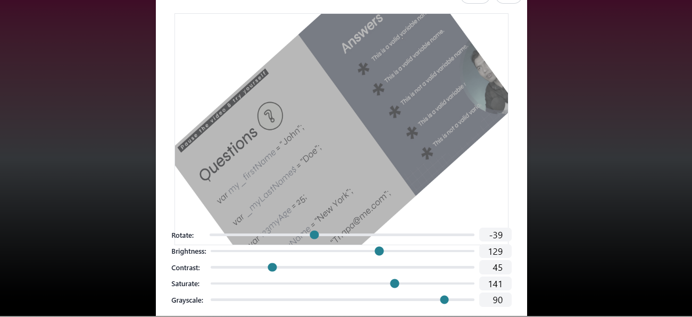
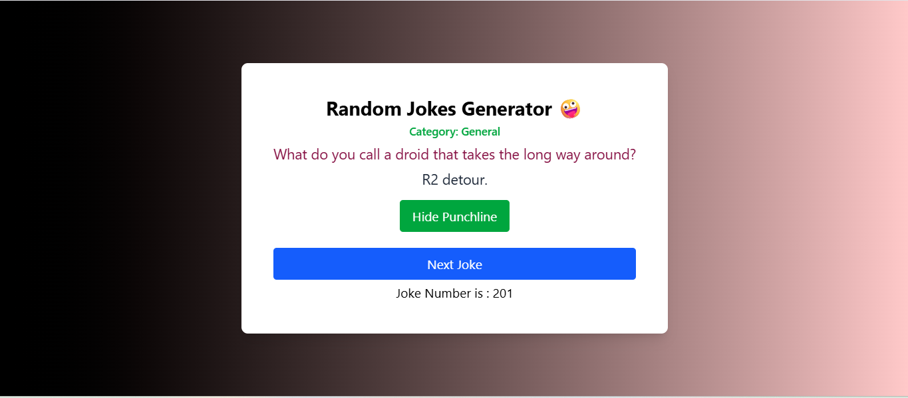
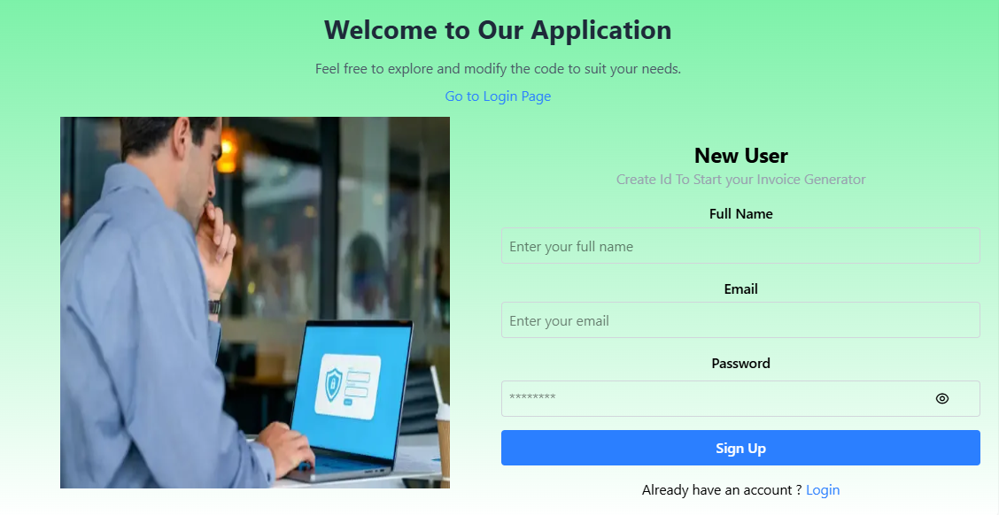
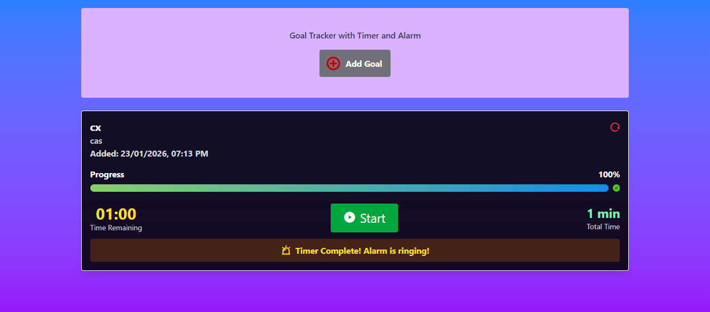

#  100 Days Of ReactJs Coding Repo

This is my 100-days Hard Projects challenge to level up ReactJS skills.
Every day, I build a project that teaches something new and useful.
From hooks to APIs, UI to performance, every project is a step forward.
The goal is consistency, learning by doing, and facing real coding challenges.
Projects are small, practical, and organized by day to track progress.
This repo is a commitment to growth, discipline, and improvement.
You can follow along, try the projects, or get inspired for your own journey.
Mistakes, fixes, and lessons learned are all part of the process here.
Every line of code is progress, and progress leads to mastery.
Let's Start to build, learningsssss , and growssss in ReactJs ! 

 -   

# Installation :
Instructions so others can clone and run your projects locally:
- git clone https://github.com/Zeeshanelia/100-Days-Of-React-Js-Coding-Repo.git
- cd project-folder
- npm i
- npm run dev

# Table of Contents :
- About
- Features
- Project List
- Installation
- Usage
- Contributing

# Features or Skills Covered :
List what concepts each project or the repo as a whole covers:
- React Components & Props
- State & Hooks
- Context API
- Routing with React Router
- API Integration
- UI/UX & Styling
- Performance Optimization & much more...

## Projects List
This repository contains 100 React projects built over 100 days.  
Each project is linked below for easy access and learning.

## Learning Notes / Lessons

| Day | Project | Concept Learned | Notes / Challenges |
|-----|---------|----------------|------------------|
| 1   | [Gradient Unlimited](https://github.com/Zeeshanelia/100-Days-Of-React-Js-Coding-Repo/tree/main/1-Gradient-Unlimited) | Components, Props | Learned useEffect is a React Hook that lets you perform side effects in function components. Side effects include things like: Fetching data. Updating the DOM manually. Setting up subscriptions. Running animations |

| Day | Project | Concept Learned | Notes / Challenges |
|-----|---------|----------------|------------------|
| 2   | [Movie Search Api](https://github.com/Zeeshanelia/100-Days-Of-React-Js-Coding-Repo/tree/main/2-Movie%20Search%20Api) | useEffect with dependency array [ ]  | Learne Practiced Fetch default OMDb movies  |

| Day | Project | Concept Learned | Notes / Challenges |
|-----|---------|----------------|------------------|
| 3   | [Avatar Image Generator Axios Api](https://github.com/Zeeshanelia/100-Days-Of-React-Js-Coding-Repo/tree/main/3-Avatar%20Image%20Generator%20Axios%20Api) | Loading...  with useState ,try catch and finally used  | Learned to fetch data from an API pexels or rendom , react-toastify  |

| Day | Project | Concept Learned | Notes / Challenges |
|-----|---------|----------------|------------------|
| 4   | [Context Api initial](https://github.com/Zeeshanelia/100-Days-Of-React-Js-Coding-Repo/tree/main/4-Context%20Api%20initial) | Context Hook , ContextProvider  | Practiced updating state with using context Api  |

| Day | Project | Concept Learned | Notes / Challenges |
|-----|---------|----------------|------------------|
| 5   | [CalCulator logic](https://github.com/Zeeshanelia/100-Days-Of-React-Js-Coding-Repo/tree/main/5-CalCulator%20logic) | usestate ,Components | Learned to render dynamic logic |

| Day | Project | Concept Learned | Notes / Challenges |
|-----|---------|----------------|------------------|
| 6   | [Mini School App With React Router](https://github.com/Zeeshanelia/100-Days-Of-React-Js-Coding-Repo/tree/main/6-Mini%20School%20App%20With%20React%20Router) | react-router-dom | Learned to save maping and retrieve data  |

| Day | Project | Concept Learned | Notes / Challenges |
|-----|---------|----------------|------------------|
| 7   | [icon Persona Auto Api Finder](https://github.com/Zeeshanelia/100-Days-Of-React-Js-Coding-Repo/tree/main/7-icon%20Persona%20Auto%20Api%20Finder) | generate() , animate.css   | Learned 7 Api in 1 generate function logic |

| Day | Project | Concept Learned | Notes / Challenges |
|-----|---------|----------------|------------------|
| 8   | [Crud React](https://github.com/Zeeshanelia/100-Days-Of-React-Js-Coding-Repo/tree/main/8-Crud%20React) |  | Learned form handling and validation |

| Day | Project | Concept Learned | Notes / Challenges |
|-----|---------|----------------|------------------|
| 9   | [Crud With Student Form](https://github.com/Zeeshanelia/100-Days-Of-React-Js-Coding-Repo/tree/main/9-Crud%20With%20Student%20Form) | Forms, Validation  | Learned form handling and validation |

| Day | Project | Concept Learned | Notes / Challenges |
|-----|---------|----------------|------------------|
| 10   | [Thumnail Resize](https://github.com/Zeeshanelia/100-Days-Of-React-Js-Coding-Repo/tree/main/10-Thumnail%20Resize%20ReactJs%20App) | get-youtube-id library ,map over an array of objects | Learned map objects and return a new object with extra fields |

| Day | Project | Concept Learned | Notes / Challenges |
|-----|---------|----------------|------------------|
| 11   | [Custom Slider](https://github.com/Zeeshanelia/100-Days-Of-React-Js-Coding-Repo/tree/main/11-Custom%20Slider) | useEffect & useState for Logic with setInterval use and cleanup | Learned useState better use with other hooks |

| Day | Project | Concept Learned | Notes / Challenges |
|-----|---------|----------------|------------------|
| 12   | [Context Api Dark Mode Website](https://github.com/Zeeshanelia/100-Days-Of-React-Js-Coding-Repo/tree/main/12-Context%20Api%20Dark%20Mode%20Website) | localStorage , useEffect , nav logic for mobile | Learned set tailwind.config.js : adding this for dark mode effect darkMode: "class" |

| Day | Project | Concept Learned | Notes / Challenges |
|-----|---------|----------------|------------------|
| 13   | [ContextApi Functional Website](https://github.com/Zeeshanelia/100-Days-Of-React-Js-Coding-Repo/tree/main/13-ContextApi%20Functional%20Website) | maximum use of Context Api , Router  | Learned responsive, dynamic e-commerce React app with a functional shopping cart, global state management, dark mode, and smooth UI effects using Tailwind CSS and React Context. Gained hands-on experience with routing, debugging, custom hooks, and clean project structuring for maintainable, modern applications |   

| Day | Project | Concept Learned | Notes / Challenges |
|-----|---------|----------------|------------------|
| 14   | [Google Translate Clone](https://github.com/Zeeshanelia/100-Days-Of-React-Js-Coding-Repo/tree/main/14-%20Google%20Translate%20Clone)  | maximum use of Axios Api , useEffect, useState, useCallback  | Learned Built a Google Clone using React for a dynamic search interface.Implemented language translation features using APIs for multi-language support. Used useState and useEffect for state and side-effect management. Optimized API calls with Axios and useCallback for smooth performance.|

| Day | Project | Concept Learned | Notes / Challenges |
|-----|---------|----------------|------------------|
| 15   | [ContextApi Functional Website](https://github.com/Zeeshanelia/100-Days-Of-React-Js-Coding-Repo/tree/main/15-Login%20Form%20with%20useReducer%20Mini%20Pro) | Login logOut Form  useReducer useState with hide show password username | Learned Login & Logout Form in React using useReducer for state management.Handle username and ID inputs smoothly with controlled components. Learn simple, clean, and efficient form handling | 

| Day | Project | Concept Learned | Notes / Challenges |
|-----|---------|----------------|------------------|
| 16  | [ Emoji Finder React App ]( https://github.com/Zeeshanelia/100-Days-Of-React-Js-Coding-Repo/tree/main/16-Emoji%20Finder%20App )  | useState practice & download logic uses <a>tag clicks | Learned An emoji is NOT an image
Emojis such as 😀 or 😎 are text characters, not image files. This is why they cannot be downloaded directly as .jpg or .png .Convert emojis into real images (PNG/JPG) Use canvas drawing .Create flexible React download functions
Trigger file downloads programmatically |

| Number of Project or Day | Project Name | Concepts Learned | Notes OR Challenges |
|-----|---------|----------------|------------------|
| 17  |[ContextApi Functional Website]( https://github.com/Zeeshanelia/100-Days-Of-React-Js-Coding-Repo/tree/main/13-ContextApi%20Functional%20Website ) | maximum use of   | Learned  |   

| Number of Project or Day | Project Name | Concepts Learned | Notes OR Challenges |
|-----|---------|----------------|------------------|
| 18 |[Ecommerce With Context Api & useEffect Rest Api](https://github.com/Zeeshanelia/100-Days-Of-React-Js-Coding-Repo/tree/main/18%20-%20Ecommerce%20With%20Context%20Api%20%26%20useEffect%20Rest%20Api) | maximum use Context API with useEffect with Real World Project   | Learned best approach useEffect to Update Context with fetching data | 

| Number of Project or Day | Project Name | Concepts Learned | Notes OR Challenges |
|-----|---------|----------------|------------------|
| 19 |[ Image Rezise Finder ](https://github.com/Zeeshanelia/100-Days-Of-React-Js-Coding-Repo/tree/main/19%20-%20image%20Resize%20Finder%20App) | maximum use useState with best logic approach   | Learned in this project It calculates and displays image width and height dynamically. useState is used for managing image data and dimensions. Users can upload an image and get instant results.The interface is clean, responsive, and easy to use.
Ideal for learning React state management and file handling. | 

| Number of Project or Day | Project Name | Concepts Learned | Notes OR Challenges |
|-----|---------|----------------|------------------|
| 20 | [ QR Code Generator React JS App ](https://github.com/Zeeshanelia/100-Days-Of-React-Js-Coding-Repo/tree/main/20%20-%20QR%20Code%20Generator) | maximum use useState , useRef with Ant Design (AntD) Form components are used for structured and validated inputs. | Learned This project is a QR Code Generator built using React JS. It allows users to generate QR codes for text or URLs instantly. The application uses the useRef hook for direct DOM access and input handling.
Ant Design (AntD) Form components are used for structured and validated inputs.
Tailwind CSS is applied for modern, responsive, and clean UI styling. Users can customize QR code size and appearance.The app supports dynamic updates without page reloads.
State management is handled using React hooks.The UI includes smooth animations for better user experience.The project follows a clean and modular component structure.
It is beginner-friendly and easy to understand. Ideal for practice, demos, and small utility projects. | 

| Number of Project or Day | Project Name | Concepts Learned | Notes OR Challenges |
|-----|---------|----------------|------------------|
| 21 | [ Image Resize React App ](https://github.com/Zeeshanelia/100-Days-Of-React-Js-Coding-Repo/tree/main/21%20-%20Canvas%20Image%20Resizer) | create logic approch with useState Form components are used for structured and validated inputs. | Learned This React application demonstrates a practical image resizing solution using hooks. It focuses on a clear and logical implementation built with useState. Users can upload an image and view its original dimensions instantly. Custom width and height inputs allow controlled resizing.
State management ensures real-time updates without page reloads. The logic separates original and resized dimensions for accuracy. Basic validation prevents invalid or empty inputs.
The UI is lightweight and responsive for better usability. This project helps understand state-driven rendering in React. Ideal for beginners learning React logic and hook-based workflows. | 

| Day | Project | Concept Learned | Notes / Challenges |
|-----|---------|----------------|------------------|
| 22  | [ Currency Converter React App ](https://github.com/Zeeshanelia/100-Days-Of-React-Js-Coding-Repo/tree/main/22%20-%20Currency%20Converter) |  input validation  useState , Axios , demonstrates API integration | Learned This Currency Converter is a React.js application built using functional components and the useState hook. It allows users to enter an amount and select source and target currencies for conversion. Axios is used to fetch real-time exchange rates from a public currency exchange API. The application handles loading states to improve user experience during API requests. Basic input validation prevents invalid or negative amounts from being converted. Error handling is implemented to display user-friendly messages when the API fails. Tailwind CSS is used for responsive layout and clean UI styling.The converter supports multiple currencies such as USD, PKR, INR, and AUD.
The result is displayed dynamically after successful conversion. This project demonstrates API integration, state management, and clean UI design in React. |

| Day | Project | Concept Learned | Notes / Challenges |
|-----|---------|----------------|------------------|
| 23  | [ Password Generator App ](https://github.com/Zeeshanelia/100-Days-Of-React-Js-Coding-Repo/tree/main/23%20-%20Password%20Generator) | best usecase of useState   | Learned Random Password Generator using useState and TailwindCSS.Generates secure passwords with customizable length based on a predefined pattern.Users can input desired password length and generate a random password instantly.Displays the generated password in a read-only field with copy icon for convenience.Styled with responsive layout, gradients, shadows, and modern UI elements. Perfect for quickly creating strong passwords for online accounts and security needs. |

| Day | Project | Concept Learned | Notes / Challenges |
|-----|---------|----------------|------------------|
| 24  | [ Sticky Note React App ](https://github.com/Zeeshanelia/100-Days-Of-React-Js-Coding-Repo/tree/main/24%20-%20Sticky%20Notes%20App) | toggle-based UI , best use parent–child component communication with usestate  | Learned Users can add multiple notes dynamically using React state management.Each note supports inline editing with a simple toggle-based UI.Text updates are handled efficiently through parent–child component communication.Notes can be deleted individually without affecting others.
The layout is responsive and adapts to different screen sizes. Clean component structure improves readability and maintainability. This project demonstrates practical use of React hooks and UI state control.  |

| Day | Project | Concept Learned | Notes / Challenges |
|-----|---------|----------------|------------------|
| 25  | [ Quiz application ](https://github.com/Zeeshanelia/100-Days-Of-React-Js-Coding-Repo/tree/main/25%20-%20Quiz%20App) |  props , array extract and useState  | learned This is a React Quiz App built using useState for state management.The app displays multiple-choice array-based questions imported from arrayQuestions.jsx.Users can select answers and navigate between questions using Previous and Next buttons. Each selected answer is compared with the correct answer to calculate the score.The app tracks the current question index, selected choice, and total score.Once all questions are answered, it shows a Quiz Result screen with total score.Users can restart the quiz, which resets all states including score and selections.Styling is implemented using Tailwind CSS for responsive and clean UI.Remixicon icons are used for Previous/Next navigation buttons.The app ensures real-time score updating and smooth question transitions for an interactive quiz experience. |

| Day | Project | Concept Learned | Notes / Challenges |
|-----|---------|----------------|------------------|
| 26  | [ validation with Zod  ](https://github.com/Zeeshanelia/100-Days-Of-React-Js-Coding-Repo/tree/main/26-validation-with-zod) |  Zod lib. Form Validation Project and useState  | learned A simple React form with email and password inputs.Uses state to manage form values and errors.Validates inputs on form submission (required fields, email format, password length). Displays error messages below inputs when validation fails.Clears specific errors as the user types for better UX.Uses spread operator (...) to update state immutably. |

| Day | Project | Concept Learned | Notes / Challenges |
|-----|---------|----------------|------------------|
| 27  | [ Text Editor App  ](https://github.com/Zeeshanelia/100-Days-Of-React-Js-Coding-Repo/tree/main/27-%20Tiptap%20text%20editor) |    | learned This React app integrates TipTap, a modern rich text editor, with Tailwind CSS styling.It supports bold, headings (H1–H6), paragraphs, code, code blocks, line breaks, and horizontal rules.Users can save content, and undo/redo actions are fully functional.The editor is responsive and provides a clean, scrollable toolbar.
Saved HTML content is displayed below the editor for easy review or backend submission. This setup is ideal for creating blogs, notes, or any rich text input in React projects. |

| Day | Project | Concept Learned | Notes / Challenges |
|-----|---------|----------------|------------------|
| 28  | [ Dynamic Accordion  ](https://github.com/Zeeshanelia/100-Days-Of-React-Js-Coding-Repo/tree/main/28-Dynamic%20Accordion) | useState with props and toggle   | learned It displays a list of questions, and users can toggle the visibility of the answers by clicking the "Show" or "Close" buttons. Dynamic FAQ rendering using React. Toggle functionality to show or hide answers.Smooth UI with hover effects and transitions. |

| Day | Project | Concept Learned | Notes / Challenges |
|-----|---------|----------------|------------------|
| 29  | [  Crypto Tracker React App  ]( https://github.com/Zeeshanelia/100-Days-Of-React-Js-Coding-Repo/tree/main/29%20-%20Crypto%20Tracker%20App ) | Api with useEffect , useState with other functiolity search for coins | learned This React app displays top cryptocurrencies in PKR using the CoinGecko API. It shows coin name, symbol, price, 24h change, volume, and market cap in a responsive table. Users can search for coins by name or symbol using the search bar.The 24h price change is color-coded: green for positive, red for negative.Fully frontend-only, no API key is required, and works directly in the browser.Built with React, TailwindCSS, and functional components for easy customization. |

| Day | Project | Concept Learned | Notes / Challenges |
|-----|---------|----------------|------------------|
| 30  | [  Random Joke Generator React App  ]( https://github.com/Zeeshanelia/100-Days-Of-React-Js-Coding-Repo/tree/main/30%20-%20Random%20Joke%20Generator ) |  useEffect , useState with logic | learned This project is a Random Joke Generator built using React.js and Hooks.It fetches jokes from a public API using the Fetch API.The joke setup is displayed first to the user. A button allows users to reveal the punchline on click.State management is handled using useState and useEffect.The UI is styled with Tailwind CSS and Animate.css for better user experience. |

| Day | Project | Concept Learned | Notes / Challenges |
|-----|---------|----------------|------------------|
| 31  | [   Event Manager ReactJs App  ]( https://github.com/Zeeshanelia/100-Days-Of-React-Js-Coding-Repo/tree/main/31-%20Event%20Manager%20App ) |  useEffect , useState with logic | learned to display and filter events efficiently. Users can browse a list of upcoming events with detailed information including date, location, and description.The app provides month and year filtering to help users find relevant events quickly.React Router is used for smooth navigation between pages.Tailwind CSS is implemented for a modern, responsive, and clean user interface.Reusable components improve code readability and maintainability.Event data is dynamically rendered using JavaScript array methods.The filtering logic is handled using controlled components and state management.The application follows a mobile-first responsive design approach.This project is ideal for practicing React fundamentals and UI structuring.  |

| Day | Project | Concept Learned | Notes / Challenges |
|-----|---------|----------------|------------------|
| 32  | [ User Authentication With Login Signup ]( https://github.com/Zeeshanelia/100-Days-Of-React-Js-Coding-Repo/tree/main/32-%20User%20Authentication%20With%20Login%20Signup ) |  logic of firebase authentication with useState   | learned modern  system built with React and Firebase Authentication. It supports secure user login and registration using email and password.Firebase handles authentication, session management, and user security. Password visibility toggle improves usability during authentication. Error handling provides clear feedback for invalid credentials or network issues. The app uses React Router for seamless navigation between pages. This authentication module can be easily integrated into larger applications. |

| Day | Project | Concept Learned | Notes / Challenges |
|-----|---------|----------------|------------------|
| 33  | [ React Password Protected Contact With Zastand ]( https://github.com/Zeeshanelia/100-Days-Of-React-Js-Coding-Repo/tree/main/33-%20React%20Password%20Protected%20Contact%20With%20Zastand ) |  logic With Zastand | learned This React application demonstrates modal-based form handling using Ant Design components.useState is used to control modal visibility for password unlocking and adding contacts. The UI is styled with Tailwind CSS, Animate.css, and Remix Icons for a modern experience.Contacts are displayed in a responsive table layout.Sensitive contact information is protected via a password modal.
Ant Design Form validation ensures required inputs are provided.The Add Contact modal allows users to dynamically submit new contact data. This project is suitable for learning modal workflows and form state management in React. |

| Day | Project | Concept Learned | Notes / Challenges |
|-----|---------|----------------|------------------|
| 34  | [ ShopEase Navigation Component ]( https://github.com/Zeeshanelia/100-Days-Of-React-Js-Coding-Repo/tree/main/34-%20ShopEase%20Navigation%20Component ) |  Tailwind CSS ,Remix Icons  | learned A fully responsive, modern navigation bar built with React and Tailwind CSS. Features a mobile-friendly design with smooth animations and intuitive user interactions. |

| Day | Project | Concept Learned | Notes / Challenges |
|-----|---------|----------------|------------------|
| 35  | [ World Timezone App ]( https://github.com/Zeeshanelia/100-Days-Of-React-Js-Coding-Repo/tree/main/35-%20World%60s%20TimeZone%20App ) | useEffect , setInterval , setTime demonstrates time zone handling useState with Tailwind CSS  ready | learned handling with using Moment Timezone in a React application. Country and time zone data are stored as an array of objects for easy scalability.React useState is used to manage the selected country and its time zone dynamically.Moment Timezone converts and formats time based on the selected time zone.
The UI updates in real time when the user changes the country selection.The implementation follows clean, reusable component structure.This setup is ideal for time converters, schedulers, and global applications. |

| Day | Project | Concept Learned | Notes / Challenges |
|-----|---------|----------------|------------------|
| 35  | [ World Timezone App ]( https://github.com/Zeeshanelia/100-Days-Of-React-Js-Coding-Repo/tree/main/34-%20ShopEase%20Navigation%20Component ) | useEffect , setInterval , setTime demonstrates time zone handling useState with Tailwind CSS  ready | learned handling with using Moment Timezone in a React application. Country and time zone data are stored as an array of objects for easy scalability.React useState is used to manage the selected country and its time zone dynamically.Moment Timezone converts and formats time based on the selected time zone.
The UI updates in real time when the user changes the country selection.The implementation follows clean, reusable component structure.This setup is ideal for time converters, schedulers, and global applications. |

| Day | Project | Concept Learned | Notes / Challenges |
|-----|---------|----------------|------------------|
| 36  | [ Pomodoro Timer App ]( https://github.com/Zeeshanelia/100-Days-Of-React-Js-Coding-Repo/tree/main/36-%20Pomodoro%20Timer%20App ) | useEffect , setInterval , React and Zustand that helps users track goals useState with Tailwind CSS | learned Goal Management: Create, track, and manage multiple goals with descriptions and custom timers Visual Progress Tracking: Interactive progress bars with gradient colors showing real-time completion status Smart Timer System: Countdown timers with start/pause/reset functionality and automatic alarm notifications Audio Alerts: Customizable alarm sounds that trigger when timers complete Persistent Storage: All goals and progress are saved locally using Zustand persistence Modern UI: Elegant design with Ant Design components, gradient backgrounds, and smooth animations Responsive Design: Works seamlessly across desktop and mobile devices. |

| Day | Project | Concept Learned | Notes / Challenges |
|-----|---------|----------------|------------------|
| 37  | [ Data Export CSV App ]( https://github.com/Zeeshanelia/100-Days-Of-React-Js-Coding-Repo/tree/main/37-%20Data%20Export%20CSV ) | Antd design , Csv useEffect , setInterval  useState with Tailwind CSS  ready | learned Form Input Application built using React.js and Ant Design (AntD) components. The project demonstrates controlled form handling with validation using AntD Form. User input data is managed efficiently with React state and event handling. Submitted form data is stored in a structured format within the application. The application includes a CSV downloader to export user input data. CSV files are generated dynamically based on submitted form values. This project highlights clean UI design and practical data export functionality. |

| Day | Project | Concept Learned | Notes / Challenges |
|-----|---------|----------------|------------------|
| 38  | [ Advanced Task Planner With Zustand App ]( https://github.com/Zeeshanelia/100-Days-Of-React-Js-Coding-Repo/tree/main/38-%20Advanced%20Task%20Planner%20With%20Zustand ) | useEffect , setInterval  useState with Tailwind CSS  ready | learned 
 |

| Day | Project | Concept Learned | Notes / Challenges |
|-----|---------|----------------|------------------|
| 39  | [ To Do Using useReducer ]( https://github.com/Zeeshanelia/100-Days-Of-React-Js-Coding-Repo/tree/main/39-%20To%20Do%20using%20useReducer ) | useReducer Form handling with  useState & Tailwind CSS | learned A modern task management application built with React and useReducer. Features full CRUD operations with a clean, responsive UI. The app demonstrates state management using React's useReducer hook, offering predictable state transitions through reducer patterns. Includes gradient backgrounds, smooth transitions, and intuitive task editing capabilities. Perfect for learning React state management concepts in a practical implementation. |

| Day | Project | Concept Learned | Notes / Challenges |
|-----|---------|----------------|------------------|
| 40  | [ Form Management with Zustand ]( https://github.com/Zeeshanelia/100-Days-Of-React-Js-Coding-Repo/tree/main/Admin%20Panel%20Layout%20Responsive%20-%20Copy ) | Form Persistence , Form handling with Zustand State Management,  useState & Tailwind CSS | learned A modern, responsive sign-in form built with React and Zustand for state management, featuring form persistence and smooth animations. 
User inputs data → Local component state updates.
Zustand store syncs → Global state updates
Persistence middleware → localStorage saves (if remembered)
Page reload → State auto-restores from localStorage. |

 - Project 1  
 
 

 - Project 2 

  

 - Project 3 

  

 - Project 4 

 

 - Project 5 

  

 - Project 6  

  

 - Project 7 

  

 - Project 8 

   

 - Project 9  

  

 - Project 10  

 

 - Project 11 

  

 - Project 12 

  

 - Project 13 

  

 
  - Project 14 

  

 - Project 15 

  

  - Project 16

  

    - Project 17

  

  - Project 18

  

  

   - Project 19

   

  - Project 20

   
   

 - Project 21

   

- Project  22

  

- Project  23

  

- Project  24

 - 

- Project  25

 - 

- Project  26

 - 

 - Project 27

 

 - Project 28

 

 - Project 29

 

- Project 30

 

- Project 31  
 
 

- Project 32  
 
 

- Project 33  
 
 

 - Project 34  
 
 

  - Project 35  
 
 

  - Project 36  
 
 

   - Project 37  
 
 

 - Project 38  
 
 

   - Project 39  
 
 

  - Project 40  
 
 

  

## Acknowledgements

I would like to express my gratitude to the following resources and mentors who helped me throughout this 100-day ReactJS journey:

- [ReactJS Official Documentation](https://reactjs.org/docs/getting-started.html) – for providing comprehensive guidance on React concepts.
- [Sir Sourav React Tutorials](https://www.youtube.com/@codingott) – for clear and practical project tutorials.
- [Sir Ahsan React Tutorials](https://www.youtube.com/codewithahsan) – for in-depth explanations and coding insights.
- [FreeCodeCamp React Tutorials](https://www.freecodecamp.org/) – for beginner-friendly tutorials and exercises.
- Special thanks to Sir Sourav, Sir Ahsan the ReactJS mentor for their guidance, support, and encouragement.
                   
       