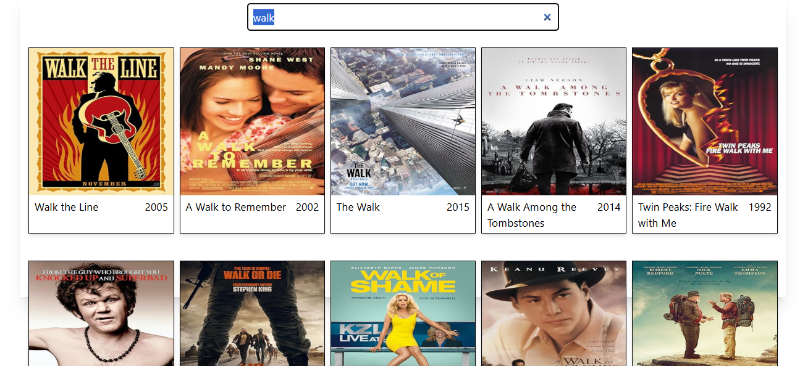
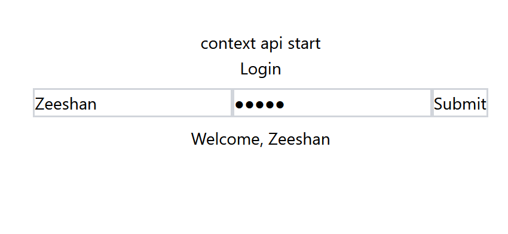
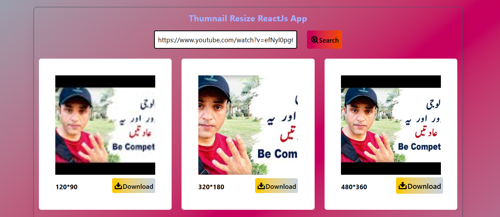
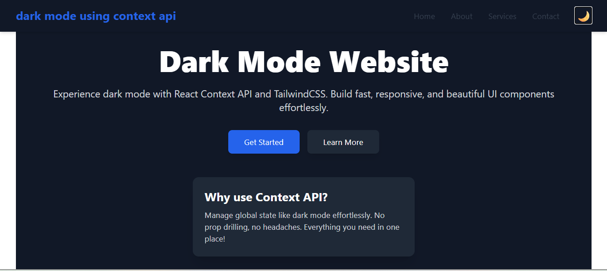
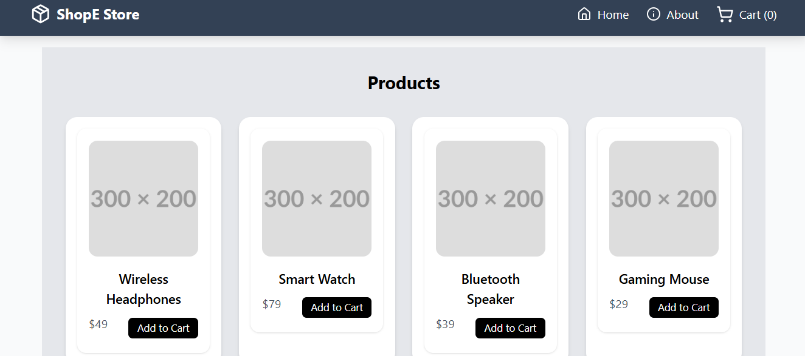
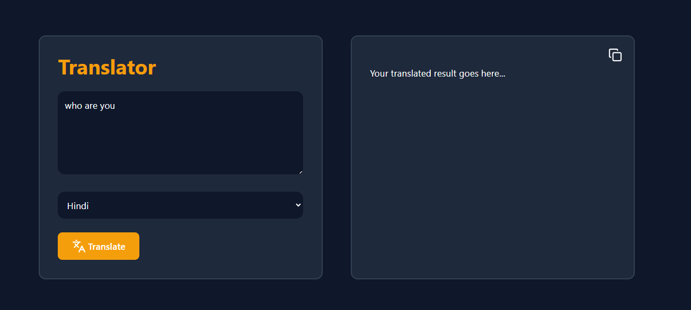

#  100 Days Of ReactJs Coding Repo

This is my 100-days Hard Projects challenge to level up ReactJS skills.
Every day, I build a project that teaches something new and useful.
From hooks to APIs, UI to performance, every project is a step forward.
The goal is consistency, learning by doing, and facing real coding challenges.
Projects are small, practical, and organized by day to track progress.
This repo is a commitment to growth, discipline, and improvement.
You can follow along, try the projects, or get inspired for your own journey.
Mistakes, fixes, and lessons learned are all part of the process here.
Every line of code is progress, and progress leads to mastery.
Let's Start to build, learningsssss , and growssss in ReactJs ! 

 -   

# Installation :
Instructions so others can clone and run your projects locally:
- git clone https://github.com/Zeeshanelia/100-Days-Of-React-Js-Coding-Repo.git
- cd project-folder
- npm i
- npm run dev

# Table of Contents :
- About
- Features
- Project List
- Installation
- Usage
- Contributing

# Features or Skills Covered :
List what concepts each project or the repo as a whole covers:
- React Components & Props
- State & Hooks
- Context API
- Routing with React Router
- API Integration
- UI/UX & Styling
- Performance Optimization & much more...

## Projects List
This repository contains 100 React projects built over 100 days.  
Each project is linked below for easy access and learning.

## Learning Notes / Lessons

| Day | Project | Concept Learned | Notes / Challenges |
|-----|---------|----------------|------------------|
| 1   | [Gradient Unlimited](https://github.com/Zeeshanelia/100-Days-Of-React-Js-Coding-Repo/tree/main/1-Gradient-Unlimited) | Components, Props | Learned useEffect is a React Hook that lets you perform side effects in function components. Side effects include things like: Fetching data. Updating the DOM manually. Setting up subscriptions. Running animations |

| Day | Project | Concept Learned | Notes / Challenges |
|-----|---------|----------------|------------------|
| 2   | [Movie Search Api](https://github.com/Zeeshanelia/100-Days-Of-React-Js-Coding-Repo/tree/main/2-Movie%20Search%20Api) | useEffect with dependency array [ ]  | Learne Practiced Fetch default OMDb movies  |

| Day | Project | Concept Learned | Notes / Challenges |
|-----|---------|----------------|------------------|
| 3   | [Avatar Image Generator Axios Api](https://github.com/Zeeshanelia/100-Days-Of-React-Js-Coding-Repo/tree/main/3-Avatar%20Image%20Generator%20Axios%20Api) | Loading...  with useState ,try catch and finally used  | Learned to fetch data from an API pexels or rendom , react-toastify  |

| Day | Project | Concept Learned | Notes / Challenges |
|-----|---------|----------------|------------------|
| 4   | [Context Api initial](https://github.com/Zeeshanelia/100-Days-Of-React-Js-Coding-Repo/tree/main/4-Context%20Api%20initial) | Context Hook , ContextProvider  | Practiced updating state with using context Api  |

| Day | Project | Concept Learned | Notes / Challenges |
|-----|---------|----------------|------------------|
| 5   | [CalCulator logic](https://github.com/Zeeshanelia/100-Days-Of-React-Js-Coding-Repo/tree/main/5-CalCulator%20logic) | usestate ,Components | Learned to render dynamic logic |

| Day | Project | Concept Learned | Notes / Challenges |
|-----|---------|----------------|------------------|
| 6   | [Mini School App With React Router](https://github.com/Zeeshanelia/100-Days-Of-React-Js-Coding-Repo/tree/main/6-Mini%20School%20App%20With%20React%20Router) | react-router-dom | Learned to save maping and retrieve data  |

| Day | Project | Concept Learned | Notes / Challenges |
|-----|---------|----------------|------------------|
| 7   | [icon Persona Auto Api Finder](https://github.com/Zeeshanelia/100-Days-Of-React-Js-Coding-Repo/tree/main/7-icon%20Persona%20Auto%20Api%20Finder) | generate() , animate.css   | Learned 7 Api in 1 generate function logic |

| Day | Project | Concept Learned | Notes / Challenges |
|-----|---------|----------------|------------------|
| 8   | [Crud React](https://github.com/Zeeshanelia/100-Days-Of-React-Js-Coding-Repo/tree/main/8-Crud%20React) |  | Learned form handling and validation |

| Day | Project | Concept Learned | Notes / Challenges |
|-----|---------|----------------|------------------|
| 9   | [Crud With Student Form](https://github.com/Zeeshanelia/100-Days-Of-React-Js-Coding-Repo/tree/main/9-Crud%20With%20Student%20Form) | Forms, Validation  | Learned form handling and validation |

| Day | Project | Concept Learned | Notes / Challenges |
|-----|---------|----------------|------------------|
| 10   | [Thumnail Resize](https://github.com/Zeeshanelia/100-Days-Of-React-Js-Coding-Repo/tree/main/10-Thumnail%20Resize%20ReactJs%20App) | get-youtube-id library ,map over an array of objects | Learned map objects and return a new object with extra fields |

| Day | Project | Concept Learned | Notes / Challenges |
|-----|---------|----------------|------------------|
| 11   | [Custom Slider](https://github.com/Zeeshanelia/100-Days-Of-React-Js-Coding-Repo/tree/main/11-Custom%20Slider) | useEffect & useState for Logic with setInterval use and cleanup | Learned useState better use with other hooks |

| Day | Project | Concept Learned | Notes / Challenges |
|-----|---------|----------------|------------------|
| 12   | [Context Api Dark Mode Website](https://github.com/Zeeshanelia/100-Days-Of-React-Js-Coding-Repo/tree/main/12-Context%20Api%20Dark%20Mode%20Website) | localStorage , useEffect , nav logic for mobile | Learned set tailwind.config.js : adding this for dark mode effect darkMode: "class" |

| Day | Project | Concept Learned | Notes / Challenges |
|-----|---------|----------------|------------------|
| 13   | [ContextApi Functional Website](https://github.com/Zeeshanelia/100-Days-Of-React-Js-Coding-Repo/tree/main/13-ContextApi%20Functional%20Website) | maximum use of Context Api , Router  | Learned responsive, dynamic e-commerce React app with a functional shopping cart, global state management, dark mode, and smooth UI effects using Tailwind CSS and React Context. Gained hands-on experience with routing, debugging, custom hooks, and clean project structuring for maintainable, modern applications |

| Day | Project | Concept Learned | Notes / Challenges |
|-----|---------|----------------|------------------|
| 14   | [Google Translate Clone](https://github.com/Zeeshanelia/100-Days-Of-React-Js-Coding-Repo/tree/main/14-%20Google%20Translate%20Clone)  | maximum use of Axios Api , useEffect, useState, useCallback  | Learned Built a Google Clone using React for a dynamic search interface.  
Implemented language translation features using APIs for multi-language support.  
Used useState and useEffect for state and side-effect management.  
Optimized API calls with Axios and useCallback for smooth performance.|

| Day | Project | Concept Learned | Notes / Challenges |
|-----|---------|----------------|------------------|
| 15   | [ContextApi Functional Website](https://github.com/Zeeshanelia/100-Days-Of-React-Js-Coding-Repo/tree/main/15-Login%20Form%20with%20useReducer%20Mini%20Pro) | Login logOut Form  useReducer useState with hide show password username | Learned Login & Logout Form in React using useReducer for state management.Handle username and ID inputs smoothly with controlled components.
Learn simple, clean, and efficient form handling | 

| Day | Project | Concept Learned | Notes / Challenges |
|-----|---------|----------------|------------------|
| 16  | [ Emoji Finder React App ](  )  | useState practice & download logic uses <a>tag clicks | Learned An emoji is NOT an image
Emojis such as 😀 or 😎 are text characters, not image files.
This is why they cannot be downloaded directly as .jpg or .png.
Convert emojis into real images (PNG/JPG)
Use canvas drawing 
Create flexible React download functions
Trigger file downloads programmatically |

 - Project 1   
 

 - Project 2  
  

 - Project 3  
  

 - Project 4   
 

 - Project 5   
  

 - Project 6  
  

 - Project 7  
  

 - Project 8 
   

 - Project 9  
  

 - Project 10  
 

 - Project 11 
  

 - Project 12 
  

 - Project 13 
  
 
  - Project 14 
  

 - Project 15 
  

 - Project 16
  

   

## Acknowledgements

I would like to express my gratitude to the following resources and mentors who helped me throughout this 100-day ReactJS journey:

- [ReactJS Official Documentation](https://reactjs.org/docs/getting-started.html) – for providing comprehensive guidance on React concepts.
- [Sir Sourav React Tutorials](https://www.youtube.com/@codingott) – for clear and practical project tutorials.
- [Sir Ahsan React Tutorials](https://www.youtube.com/codewithahsan) – for in-depth explanations and coding insights.
- [FreeCodeCamp React Tutorials](https://www.freecodecamp.org/) – for beginner-friendly tutorials and exercises.
- Special thanks to Sir Sourav, Sir Ahsan the ReactJS mentor for their guidance, support, and encouragement.
                   
       